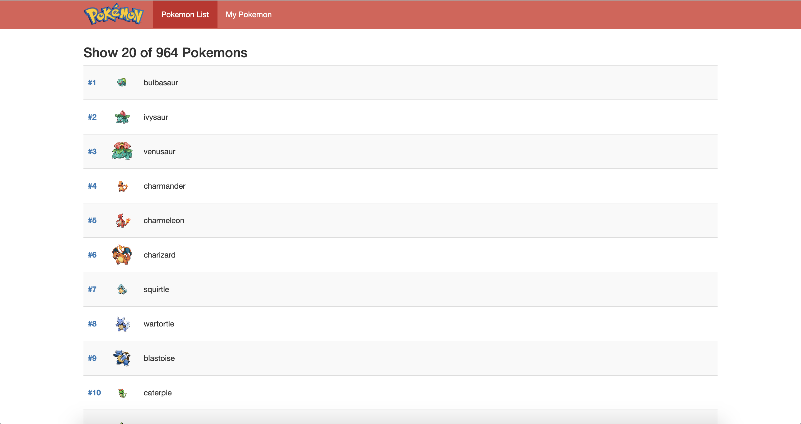
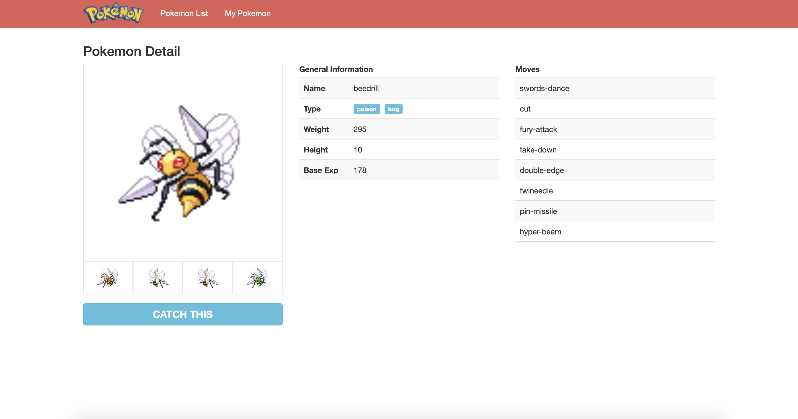
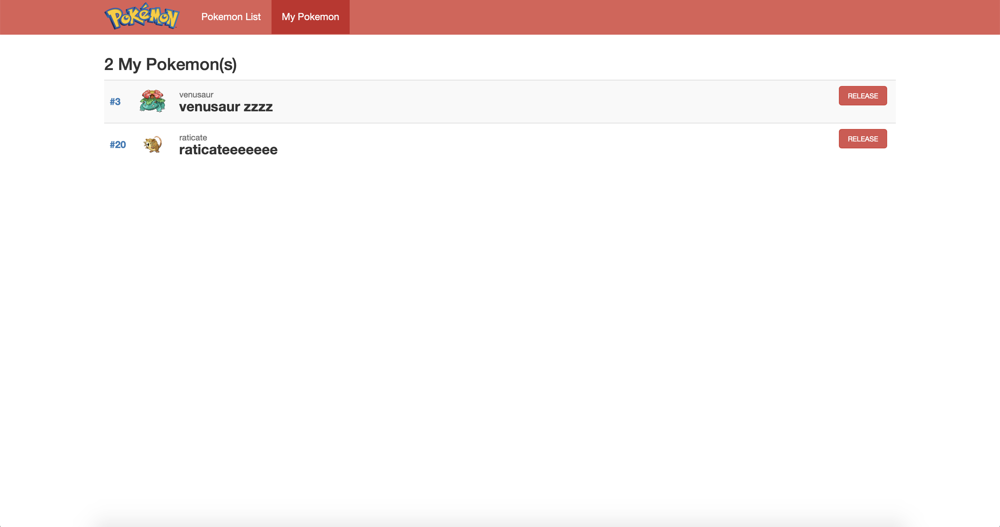

# Pokemon APP

Simple pokedex app create using ReactJS and [PokeAPI](http://pokeapi.co/)

## Prerequisites

- [Git](https://git-scm.com/)
- [Node.js and npm](nodejs.org) Node 10.15.2, npm 6.4.1

## Dependencies

- [react : ^16.8.6](https://reactjs.org)
- [react-bootstrap : ^1.0.0-beta.10](https://react-bootstrap.github.io)
- [react-dom : ^16.8.6](https://reactjs.org/docs/react-dom.html)
- [react-redux : ^7.1.0](https://github.com/reduxjs/react-redux)
- [react-router-dom : ^5.0.1](https://github.com/ReactTraining/react-router)
- [redux : ^4.0.4](https://redux.js.org)
- [redux-thunk : ^2.3.0](https://github.com/reduxjs/redux-thunk)
- [react-test-renderer : ^16.8.6](https://www.npmjs.com/package/react-test-renderer)

## Installation
```sh
$ git clone https://github.com/trionoputra/pokemon-app.git
$ cd pokemon-app/
$ npm install
$ npm start
```
</img>
</img>
</img>

## Features
- Pokemon List
- Pokemon Detail
- My Pokemon
- Catch and Release Pokemon
